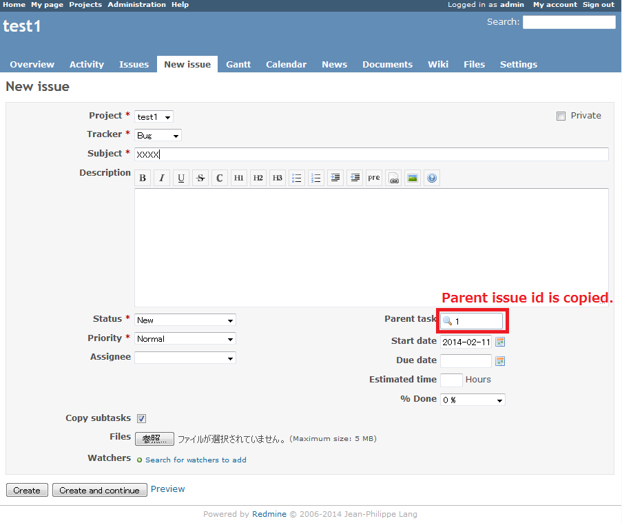

Redmine copy parent issue id plugin
===========================

This [Redmine](http://www.redmine.org) plugin also copies parent issue id, when a issue is copied.

Features
--------

Copy parent issue id, when a issue is copied.

Installation
------------

Install the plugin in your Redmine plugins directory, clone this repository as `copy_parent_issue_id`:

    cd {RAILS_ROOT}/plugins
    git clone https://github.com/onozaty/redmine-copy-parent-issue-id.git copy_parent_issue_id

**note: The directory name must be a `copy_parent_issue_id`. Directory name is different, it will fail to run the Plugin.**

Supported versions
------------------

* Redmine 2.0.x or later

License
-------

The plugin is available under the terms of the [GNU General Public License](http://www.gnu.org/licenses/gpl-2.0.html), version 2 or later.
